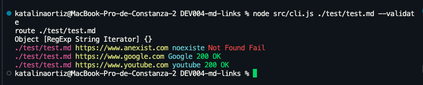
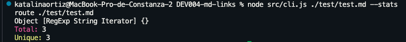
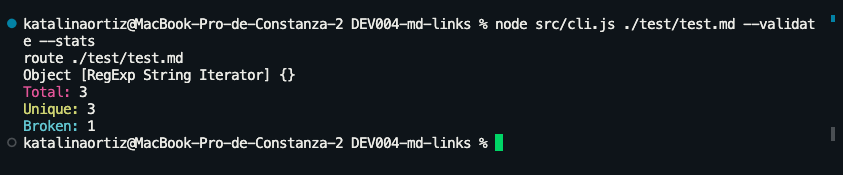
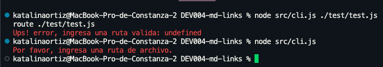
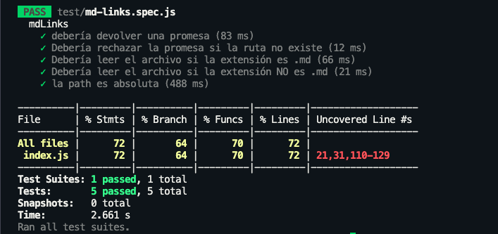
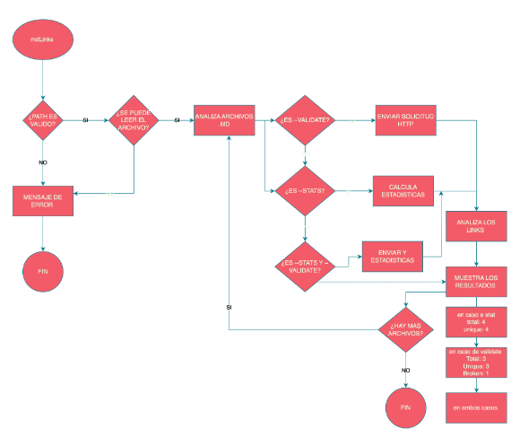
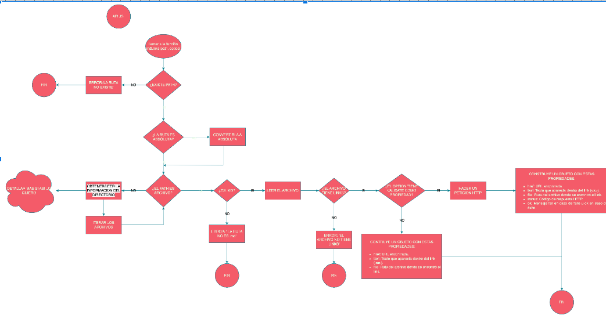

# Markdown Links

## Índice

* [1. Preámbulo](#1-Preámbulo)
* [2. Instalación](#2-Instalación)
* [3. Como funciona](#3-Como-funciona)
* [4. Errores ](#4-Errores )
* [5. Test](#5-Test)
* [6. Diagramas de flujo](#6-Diagramas-de-flujo)
***

## 1. Preámbulo
Estos archivos `Markdown` normalmente contienen _links_ (vínculos/ligas) que
muchas veces están rotos o ya no son válidos y eso perjudica mucho el valor de
la información que se quiere compartir. 

Dentro de una comunidad de código abierto, creamos una herramienta usando [Node.js](https://nodejs.org/), que lea y analice archivos en formato `Markdown`, para verificar los links que contengan y reportar algunas estadísticas.
### 2. Instalacion 

```npm i katalimbu-md-links```
### 3. Como funciona
Por medio de comandos npm puedes verificar el estado de los links de tu archivo Markdown. 

#### 3.1 ```node src/cli.js tuarchivo.md --validate```


#### 3.2 ```node src/cli.js tuarchivo.md --stats```


#### 3.3 ```node src/cli.js tuarchivo.md --validate --stats```


### 4. Errores  
``` node src/cli.js tuarchivo.js route ./test/test.js ```
``` node src/cli.js  ```


### 5. Test 



### 6. Diagramas de flujo 

Este [Diagrams](https://app.diagrams.net) fue el principal recurso de organizacion que usamos para lograr hacer esta libreria.

#### API


#### CLI



